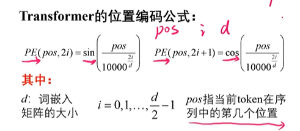
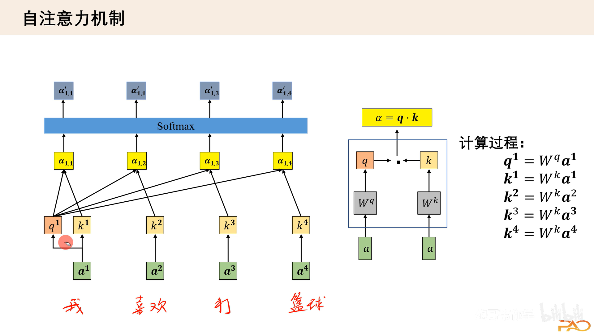
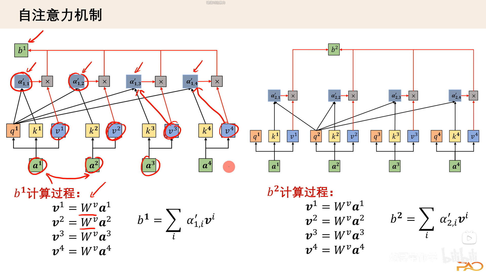
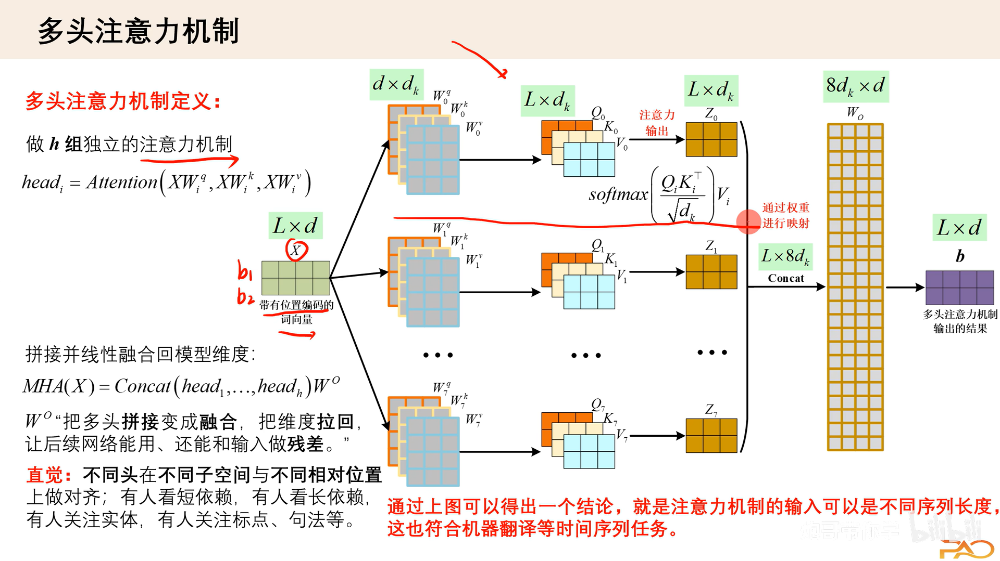
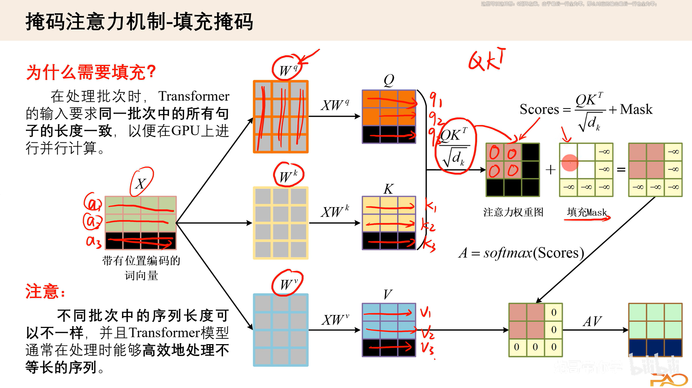
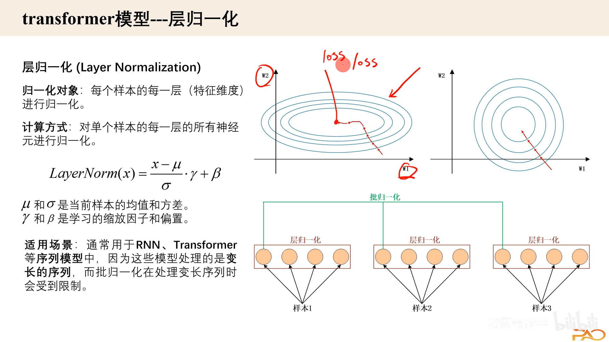
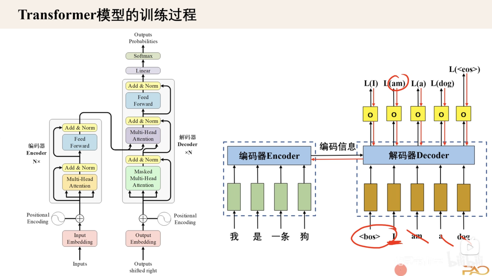
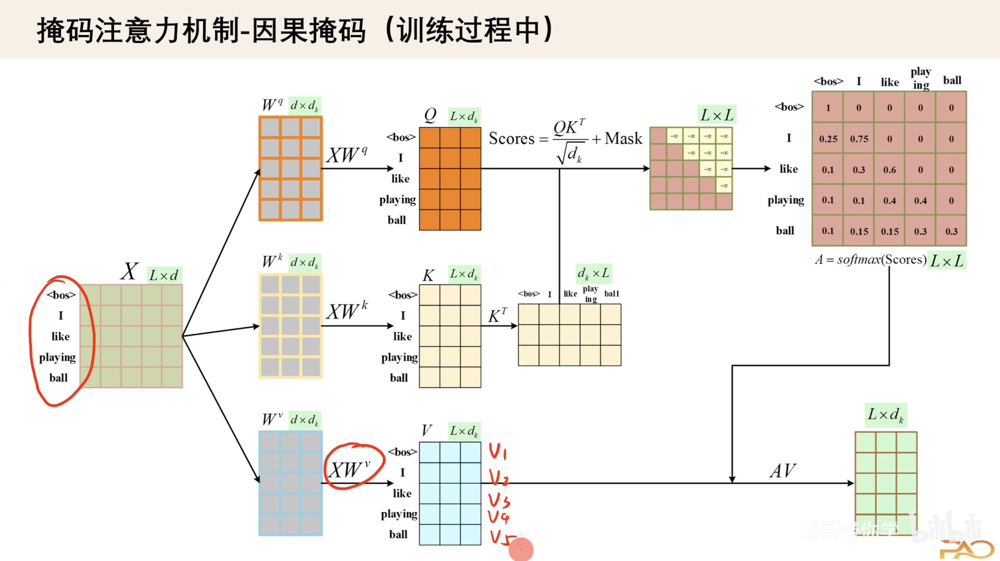
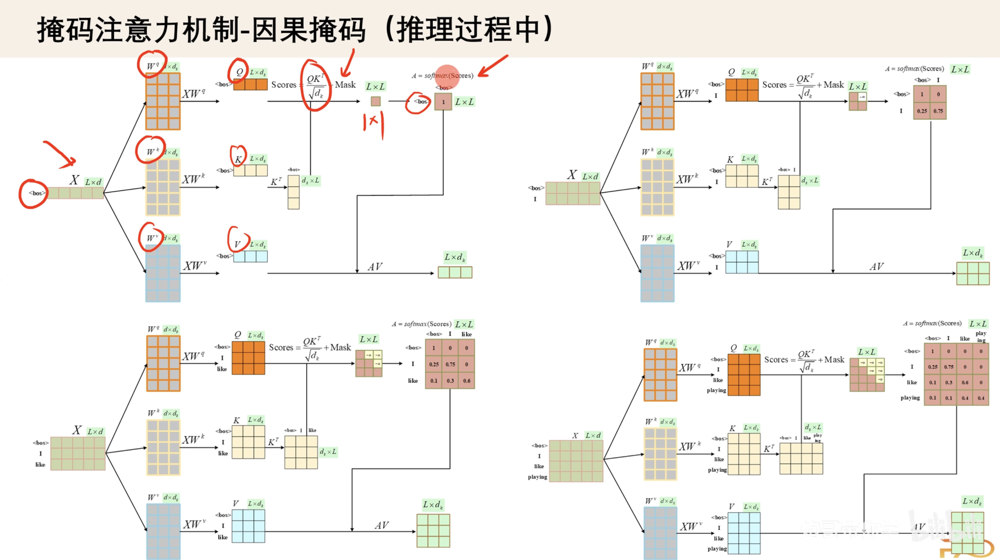

# 输入处理

## 一些特殊符号、独热编码和词嵌入

## 位置编码

保证位置编码信息是正的且长度是$d$的向量

# 注意力机制

## 自注意力

$W$是可学习的参数，自身和自身的关联程度最高

$b$是新的$q$值

多头自注意力机制

$softmax(QK^T/\sqrt{d_k})$是注意力分数

类比到卷积的multi channel，$W_O$是dense层的参数

掩码注意力：目的是为了对齐批次数量

## 归一化层和前馈层

## transformer的训练过程

一次性将输入读入，用带掩码的真实标签做批量训练。

## transformer训练过程中的因果掩码

## transformer推理过程

## 交叉注意力机制
编码器的输出作为K/V输入到交叉注意力机制，解码器因果掩码自注意力机制的输出作为Q

